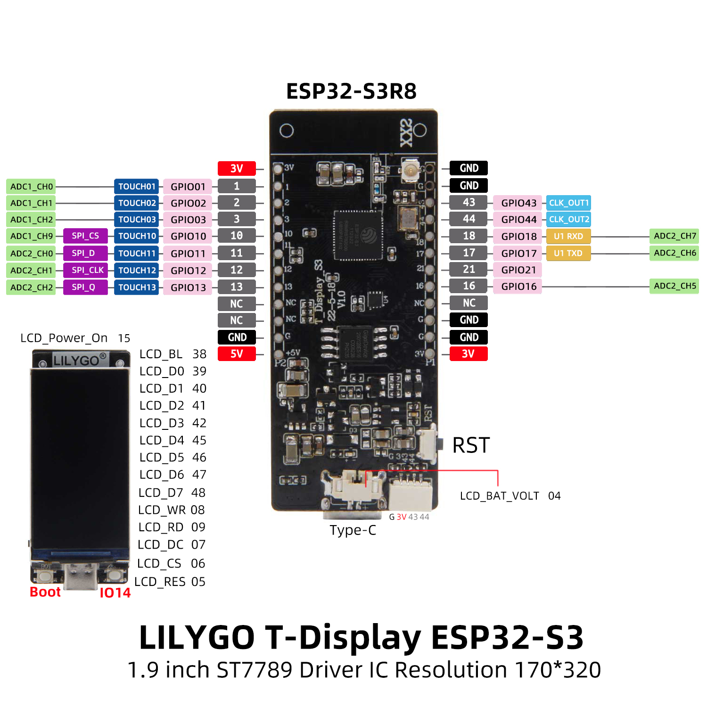

# 🛡️ ESP32-S3 Deauth Attack Detector

Портативный детектор **Deauth-атак** на базе микроконтроллера **ESP32-S3** (плата Lilygo T-Display S3) с визуализацией на встроенном TFT-экране и отправкой уведомлений на Django-сервер.

> ⚠️ **Устройство предназначено исключительно для образовательных целей и защиты собственных сетей.** Использование для атак на чужие Wi-Fi-сети без разрешения владельца является незаконным.

---

## 📖 Что такое Deauth-атака?

**Deauthentication (Deauth)** — это атака типа «отказ в обслуживании» (DoS) на беспроводные сети стандарта IEEE 802.11.

**Принцип работы атаки:**
- Злоумышленник отправляет поддельные управляющие кадры `Deauthentication` (подтип `0x0C`) или `Disassociation` (подтип `0x0A`) от имени точки доступа (AP) клиенту или наоборот.
- Эти кадры в протоколе Wi-Fi **не шифруются и не подписываются** (если не включена защита `802.11w / PMF`), поэтому устройство-жертва принимает их как легитимные и разрывает соединение.
- Цель атаки — принудительно «выкинуть» клиентов из сети. Часто используется как первый этап для перехвата WPA/WPA2 handshake с последующим оффлайн-взломом пароля.

**Цель данного устройства** — пассивно мониторить эфир и вовремя обнаруживать подозрительную активность, уведомляя пользователя через экран и сервер.

---

## ✨ Возможности устройства

- 🔍 **Пассивный сниффинг** Wi-Fi-трафика в promiscuous-режиме (режим монитора).
- 📡 **Детекция Deauth/Disassoc-кадров** по анализу заголовков IEEE 802.11.
- 📊 **Подсчёт интенсивности** атакующих пакетов (порог срабатывания — 10 пакетов/сек).
- 🔄 **Channel Hopping** — автоматическое переключение между каналами 1–11 для полного покрытия диапазона 2.4 ГГц.
- 🖥️ **Визуализация** статуса на встроенном TFT-дисплее (ST7789, 170×320).
- 🌐 **Отправка уведомлений** на Django-сервер через HTTP POST (JSON).
- 🔁 **Гибридный режим работы**: сниффинг в promiscuous-режиме + временное подключение к Wi-Fi для отправки данных.

---

## 🔧 Аппаратная часть

| Параметр         | Значение                                    |
|------------------|---------------------------------------------|
| Плата            | Lilygo T-Display S3                         |
| Микроконтроллер  | ESP32-S3 (двухъядерный Xtensa LX7, 240 МГц) |
| Wi-Fi            | 802.11 b/g/n, 2.4 ГГц                       |
| Дисплей          | TFT ST7789, 1.9", 170×320 пикселей          |
| Питание          | USB Type-C                                  |
| Среда разработки | VS Code + PlatformIO                        |
| Фреймворк        | Arduino (ESP32 Arduino Core)                |

---

## 📸 Демонстрация работы

### Внешний вид устройства


*Рисунок 1 — Внешний вид устройства (плата Lilugo-T-Display-S3)*

### Экран в режиме сканирования


*Рисунок 2 — Отображение режима сканирования*

### Экран при обнаружении атаки


*Рисунок 3 — Отображение предупреждения об атаке*

## 🏗️ Архитектура проекта

Проект построен по модульному принципу: каждый функциональный блок вынесен в отдельную пару `.h` / `.cpp` файлов.

```
ESP-32-Deauth-prototype/
├── lib/
│   └── TFT_eSPI/              # Библиотека для работы с TFT-дисплеем
├── src/
│   ├── main.cpp               # Точка входа: инициализация и главный цикл
│   ├── globals.h              # Глобальные настройки (SSID, пароли, таймауты)
│   ├── display.h / .cpp       # Модуль управления TFT-дисплеем
│   ├── wifi_manager.h / .cpp  # Подключение к Wi-Fi, сканирование сетей
│   ├── deauth_detector.h / .cpp  # Ядро проекта: сниффинг и детекция атак
│   └── telegram_notifier.h / .cpp # Отправка данных на Django-сервер
├── platformio.ini             # Конфигурация PlatformIO
└── README.md                  # Этот файл
```

### Описание модулей

| Модуль              | Назначение                                                                                       |
|---------------------|--------------------------------------------------------------------------------------------------|
| `main.cpp`          | Инициализация дисплея, запуск детектора, обработка обнаружения атаки, переключение режимов Wi-Fi |
| `globals.h`         | Глобальные константы: SSID/пароли двух сетей (для сниффинга и для отправки), таймауты            |
| `display`           | Включение питания LCD (GPIO15), настройка ШИМ подсветки (GPIO38), инициализация TFT_eSPI         |
| `wifi_manager`      | Функции `connectToWiFi()` и `connectToWiFiForSend()` для подключения к разным сетям              |
| `deauth_detector`   | Promiscuous-режим, callback-обработчик пакетов, парсинг 802.11, счётчик, channel hopping         |
| `telegram_notifier` | HTTP POST-запрос к Django API с JSON-данными об атаке                                            |

---

## 🧠 Принцип работы

### 1. Promiscuous-режим (режим монитора)

Обычный Wi-Fi-клиент принимает только пакеты, адресованные ему. В **promiscuous-режиме** ESP32 перехватывает **все** кадры в радиусе приёма на текущем канале. Это реализуется через функции ESP-IDF:

```cpp
esp_wifi_set_promiscuous(true);
wifi_promiscuous_filter_t filter = { .filter_mask = WIFI_PROMIS_FILTER_MASK_MGMT };
esp_wifi_set_promiscuous_filter(&filter);
esp_wifi_set_promiscuous_rx_cb(wifiSnifferCallback);
```

### 2. Парсинг заголовка 802.11

Каждый принятый пакет приводится к структуре `wifi_80211_mgmt_header_t`. Из поля `frameControl` извлекаются:
- **Тип кадра** (биты 2–3): должен быть `0` (Management).
- **Подтип кадра** (биты 4–7): `0x0C` (Deauth) или `0x0A` (Disassoc).

Из полей `addr2` (отправитель) и `addr3` (BSSID) извлекаются MAC-адреса атакующего и цели.

### 3. Пороговая логика детекции

Счётчик `packetCount` накапливает количество deauth-кадров за текущую секунду. Если за 1 секунду получено **≥ 10 пакетов** — фиксируется атака, взводится флаг `attackFlag`.

### 4. Channel Hopping

Каждую секунду устройство переключается на следующий канал (1 → 2 → ... → 11 → 1), что позволяет мониторить весь диапазон 2.4 ГГц.

### 5. Гибридный режим Wi-Fi

Поскольку ESP32 не может одновременно находиться в promiscuous-режиме и подключаться к сети, при обнаружении атаки устройство:
1. Выходит из promiscuous (`esp_wifi_set_promiscuous(false)`).
2. Подключается к Wi-Fi-сети, в которой находится Django-сервер.
3. Отправляет JSON с данными об атаке.
4. Отключается от Wi-Fi и возвращается в promiscuous-режим.

---

## 🚀 Установка и сборка

### Требования

- **VS Code** с установленным расширением **PlatformIO IDE**.
- Плата **Lilygo T-Display S3**.
- USB-кабель для прошивки.

### Шаги установки

1. **Клонируйте репозиторий:**
   ```bash
   git clone https://github.com/Amperka04/ESP-32-Deauth-prototype.git
   cd ESP-32-Deauth-prototype
   ```

2. **Откройте проект в VS Code:**
   ```bash
   code .
   ```

3. **Настройте Wi-Fi сети** в файле `src/main.cpp`:
   ```cpp
   const char* WIFI_SSID = "ваш_SSID";
   const char* WIFI_PASSWORD = "ваш_пароль";
   const char* WIFI_SSID_SEND = "SSID_сети_сервера";
   const char* WIFI_PASSWORD_SEND = "пароль_сети_сервера";
   ```

4. **Укажите адрес Django-сервера** в `src/telegram_notifier.cpp`:
   ```cpp
   String url = "http://10.111.31.250:8000/api/add_attack/";
   ```

5. **Скомпилируйте и залейте прошивку** через PlatformIO (кнопка `Upload` в нижней панели).

---

## 📺 Использование

1. **Включите питание** платы через USB.
2. На экране появится стартовый экран, затем статус `Sniffing...` с номером текущего канала.
3. При обнаружении Deauth-атаки экран сменится на **красное предупреждение**:
   ```
   ⚠ ATTACK!
   From: XX:XX:XX:XX:XX:XX
   Target: YY:YY:YY:YY:YY:YY
   Packets: N
   ```
4. Одновременно на сервер будет отправлен JSON-запрос.
5. После окончания атаки устройство автоматически вернётся в режим сканирования.

### Формат JSON-запроса на сервер

```json
{
  "attacker_mac": "A2:29:BC:3D:1C:67",
  "target_bssid": "50:C7:BF:E5:FE:AB",
  "packet_count": 14
}
```

---

## ⚙️ Настройки детектора

Все ключевые параметры задаются в `src/deauth_detector.cpp`:

| Параметр           | Значение по умолчанию | Описание                                             |
|--------------------|-----------------------|------------------------------------------------------|
| `DEAUTH_THRESHOLD` | `10`                  | Количество deauth-пакетов в секунду для срабатывания |
| `DETECTOR_CHANNEL` | `1`                   | Стартовый канал сканирования                         |
| `CHANNEL_HOPPING`  | `true`                | Автоматическое переключение каналов                  |
| `MAX_CHANNEL`      | `11`                  | Максимальный канал (11 для US, 13 для EU)            |

---

## 🧪 Тестирование

Для проверки работы детектора можно использовать вторую плату ESP32 с прошивкой из проекта [ESP32-Deauther](https://github.com/tesa-klebeband/ESP32-Deauther), направленную на вашу собственную тестовую сеть.

**Важно:** тестируйте только на оборудовании, принадлежащем вам, или с явного разрешения владельца сети.

---

## 📂 Структура исходных файлов

| Файл                         | Размер роли                                              |
|------------------------------|----------------------------------------------------------|
| `main.cpp`                   | Cвязывает все модули, управляет режимами Wi-Fi           |
| `globals.h`                  | Централизованное хранилище конфигурации                  |
| `display.h / .cpp`           | Работа с TFT-экраном (питание, подсветка, инициализация) |
| `wifi_manager.h / .cpp`      | Подключение к Wi-Fi (две функции для двух сетей)         |
| `deauth_detector.h / .cpp`   | Ядро: promiscuous-режим, парсинг 802.11, детекция атак   |
| `telegram_notifier.h / .cpp` | HTTP-клиент для отправки данных на Django                |

---

## 🤝 Участники проекта

- **Аппаратная часть, прошивка ESP32, анализ 802.11, детектор Deauth** — Я
- **Django-сервер, API, обработка данных** — [Напарник]

---

## 📜 Лицензия

Проект создан в учебных целях в рамках учебной практики. Код предоставляется «как есть» для образовательного использования.

---

## ⚠️ Правовое предупреждение

Данное устройство является **пассивным средством мониторинга** и предназначено для:
- изучения протокола IEEE 802.11,
- аудита безопасности собственных сетей,
- учебных и исследовательских целей.

Использование устройства для нарушения работы чужих сетей, несанкционированного сбора данных или иных противоправных действий **запрещено** и преследуется по закону (в РФ — ст. 272, 273, 274 УК РФ).